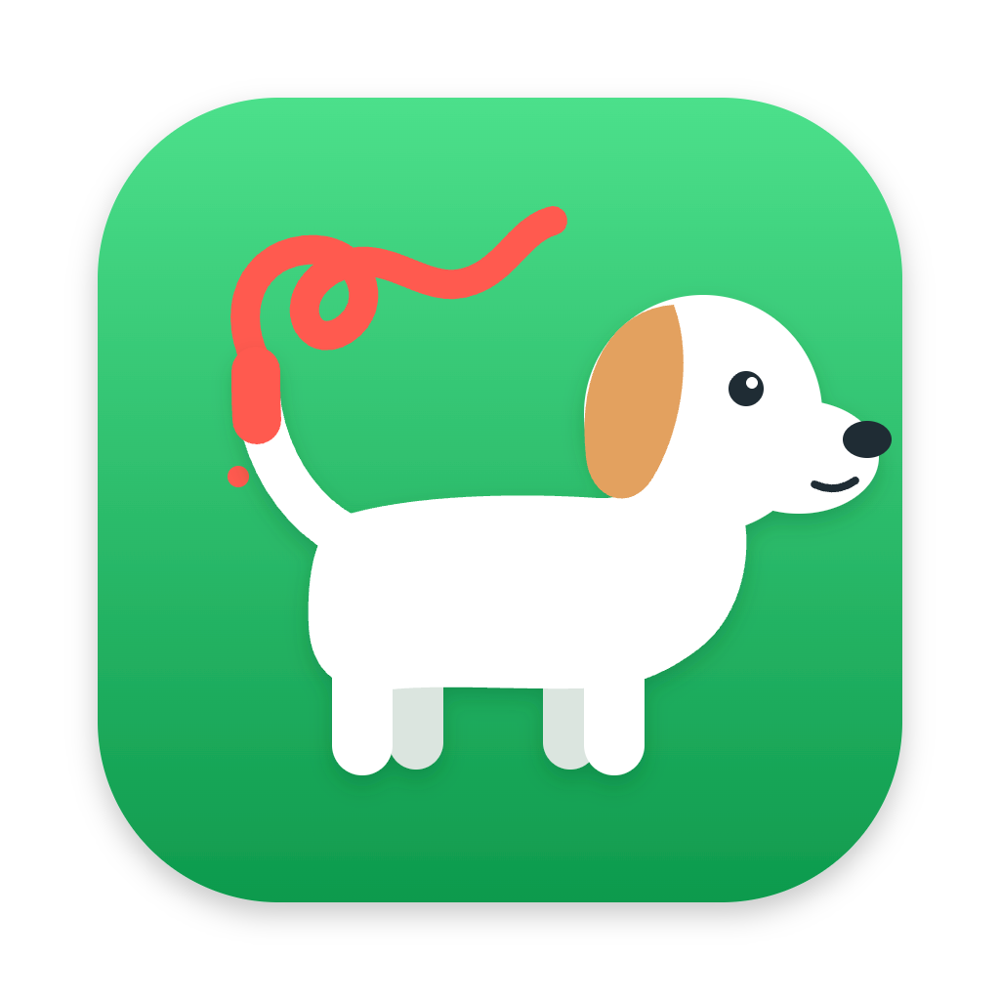
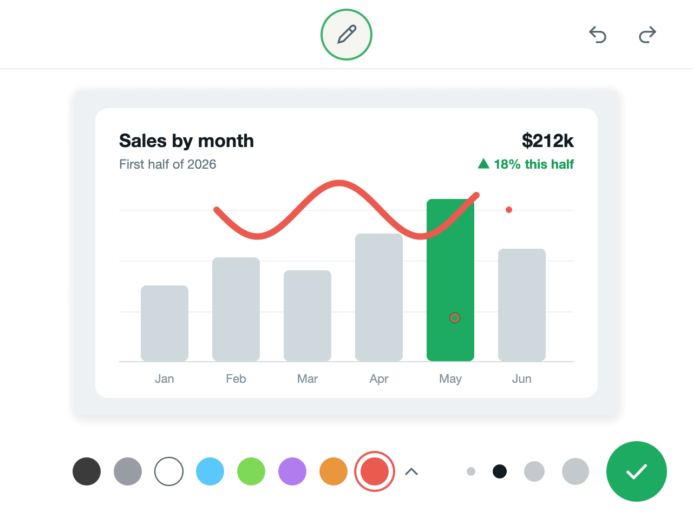
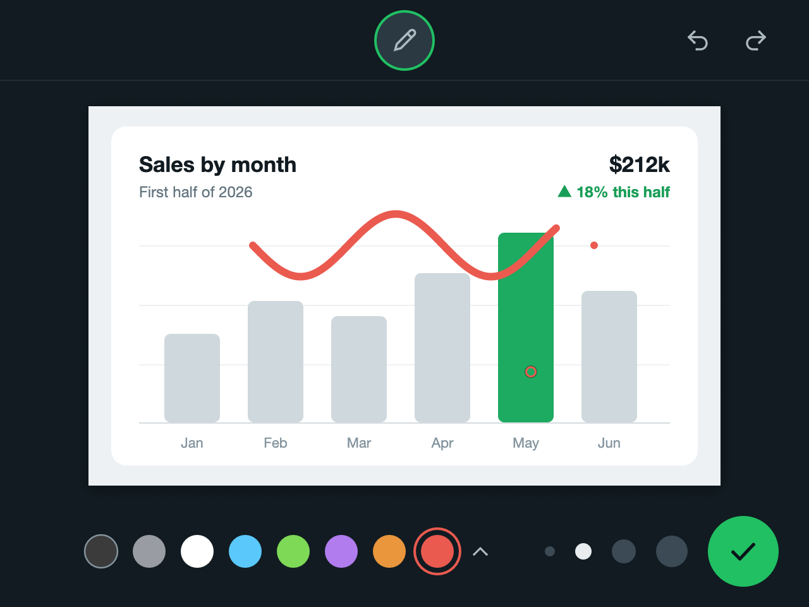

<p align="center"></p>

# Rabisco

Scribble on whatever image is on your clipboard, in the style of WhatsApp Web's photo
editor, and send it right back to the clipboard. A native macOS menu bar app, written in Rust.

*Rabisco* is Portuguese for "scribble", and *rabo* means "tail": hence the dog that paints
with its tail.

**Website:** [victorlcampos.github.io/rabisco](https://victorlcampos.github.io/rabisco/)

<p align="center">
  
  
</p>

## Usage

1. Copy an image: a screenshot with **⌃⇧⌘4** (it goes straight to the clipboard), "Copy
   Image" in a browser, or **⌘C** on an image file in Finder.
2. Press **⌃⇧⌘E** (control + shift + command + E). It's the same trio as the
   screenshot-to-clipboard shortcut: take the screenshot, swap the 4 for an E and you're
   already scribbling.
3. Scribble. Pick a color from the palette (the little arrow opens more colors) and a stroke
   width from the dots.
4. **↩** (or the green button) copies the scribbled image to the clipboard. Just paste it with ⌘V.

| Key | Action |
| --- | --- |
| ↩, ⌘S or ⌘C | copy to the clipboard and close |
| esc or ⌘W | discard (if you've drawn something, it asks for a second esc) |
| ⌘Z | undo |
| ⇧⌘Z or ⌘Y | redo |

The editor also opens from the dog in the menu bar, or by launching the app from Spotlight
or Finder. For now the pencil is the only tool, and the app's interface is in Brazilian
Portuguese.

## Install

Requires macOS 12 or later, on Apple silicon or Intel.

**Download:** grab `Rabisco.dmg` from the [latest release](https://github.com/victorlcampos/rabisco/releases/latest),
open it and drag Rabisco into **Applications**, then open it from there. Since it isn't
signed by Apple, macOS blocks the first launch: go to **System Settings → Privacy &
Security** and click **Open Anyway**. (A `Rabisco.zip` with just the app is there too.)

**Build from source:** requires [Rust](https://rustup.rs) (`rust-toolchain.toml` picks the version).

```sh
git clone https://github.com/victorlcampos/rabisco.git
cd rabisco
./scripts/install.sh
```

The script builds the app, installs it as `/Applications/Rabisco.app`, turns on launch at
login (a LaunchAgent in `~/Library/LaunchAgents`) and leaves it running in the menu bar.
Launch at login can be turned off from the menu bar menu (*Abrir ao iniciar o Mac*).
To remove everything: `./scripts/uninstall.sh`.

## Under the hood

- **Reading the clipboard:** an image file copied in Finder (JPEG honoring its EXIF
  rotation, HEIC and more), PNG, TIFF, and any other format macOS can open.
- **Writing:** PNG and TIFF at the original resolution, keeping the DPI, so Retina
  screenshots paste at the right size in Notes, Keynote and friends.
- **Strokes** are stored as vectors and redrawn at the original resolution when copying,
  by the same code that draws them on screen.
- **Global shortcut** via `RegisterEventHotKey`: no Accessibility permission needed.
- **Light when idle:** the window and the GPU only exist while the editor is open.
- **Log:** `~/Library/Logs/Rabisco.log`.

## Development

```sh
cargo test              # unit tests
./scripts/e2e.sh        # end-to-end test (replaces your clipboard contents!)
./scripts/bundle.sh     # builds target/Rabisco.app (UNIVERSAL=1 for Apple silicon + Intel)
./scripts/dmg.sh        # packs it into target/Rabisco.dmg
```

The end-to-end test (`src/selftest.rs`, behind the `selftest` feature) opens the editor,
scribbles through events injected into the UI itself, takes screenshots of the window
(rendered by the GPU, so no Screen Recording permission is needed), presses ↩ and checks
the clipboard pixel by pixel. It also covers the "no image on the clipboard" state. It runs
on GitHub Actions (macOS 15) on every push; the screenshots and `Rabisco.app` are uploaded
as workflow artifacts.

**Releasing:** bump `version` in `Cargo.toml` and push a matching tag
(`git tag v0.1.1 && git push origin v0.1.1`). The *Release* workflow builds a universal
`Rabisco.dmg` (plus a `Rabisco.zip`) and creates the release; the website's download button
always points to the latest one.

**Website:** `site/` (plain HTML, CSS and a little JS, no build step) is published to GitHub
Pages by the *Site* workflow on every push that touches it.

**Icons and DMG background:** `assets/icon.svg` (app icon), `assets/tray.svg` (menu bar) and
`assets/dmg-background.svg` are the sources; the PNGs next to them are what the build uses.
After editing an SVG, re-render it (transparent background, 1024×1024 for the icon, 36×36 for
the menu bar, 660×400 and 1320×800 for the DMG), e.g.
`rsvg-convert -w 1024 -h 1024 assets/icon.svg -o assets/AppIcon.png`.

Code comments are in Portuguese.

| File | What it does |
| --- | --- |
| `src/main.rs` | app lifecycle: menu bar, opening and closing the editor |
| `src/agent.rs` | menu bar icon and menu, global shortcut |
| `src/window.rs` | editor window (winit + egui + wgpu/Metal) |
| `src/editor.rs` | UI: pencil, palette, stroke widths, undo/redo |
| `src/canvas.rs` | strokes, undo/redo and rendering (tiny-skia) |
| `src/clipboard.rs` | NSPasteboard, PNG/TIFF and DPI |
| `src/login.rs` | launch at login (LaunchAgent) |
| `src/reopen.rs` | launching the app again opens the editor |
| `src/icons.rs`, `src/theme.rs` | icons drawn in code, and colors |
| `assets/` | app and menu bar icons, DMG background (SVG sources + PNGs) |
| `packaging/` | `Info.plist` and the DMG window layout |
| `site/` | the project website on GitHub Pages |

## License

[MIT](LICENSE)
