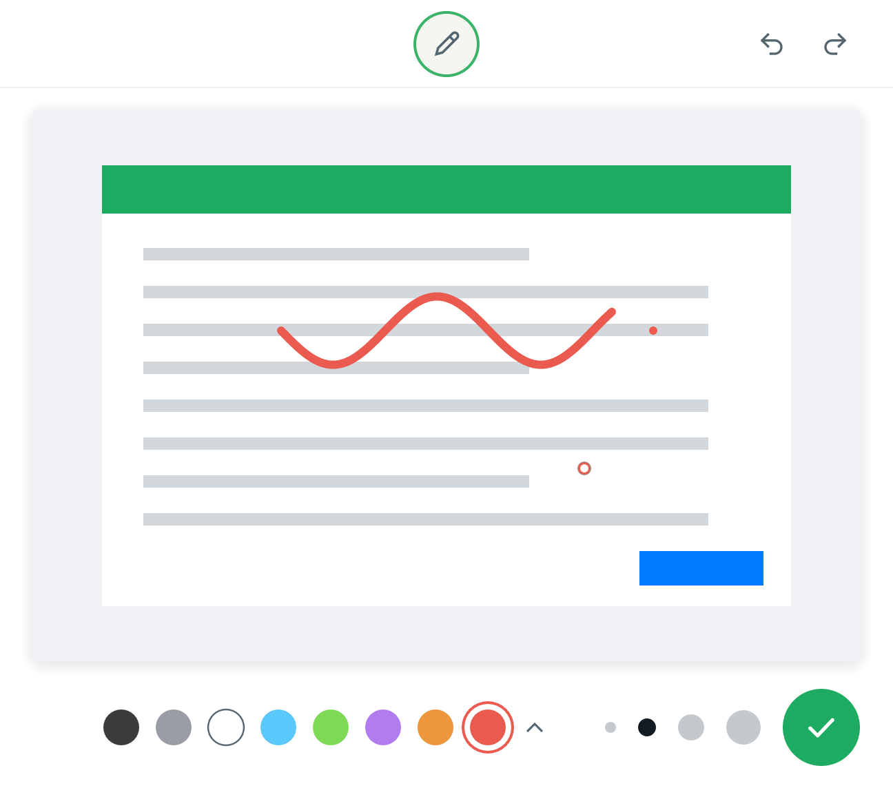
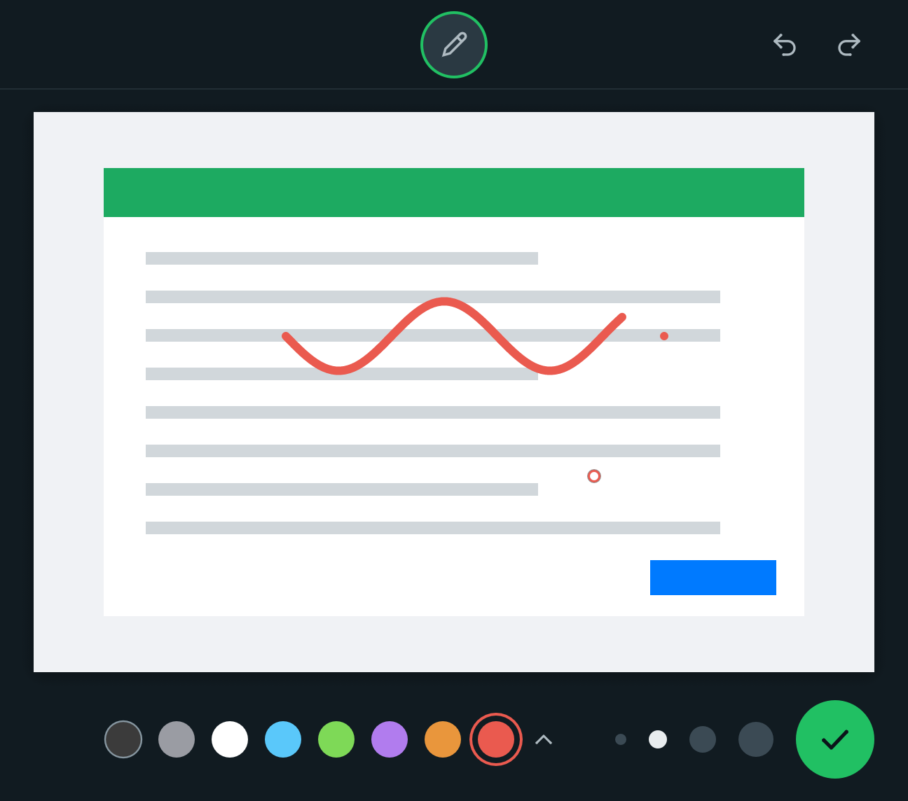

# Rabisco

Rabisque em cima da imagem que está no clipboard, no estilo do editor de fotos do
WhatsApp Web, e devolva o resultado para o clipboard. App nativo para macOS, em Rust.

**Site:** [victorlcampos.github.io/rabisco](https://victorlcampos.github.io/rabisco/)

<p align="center">
  
  
</p>

## Como usar

1. Copie uma imagem: um print com **⌃⇧⌘4** (vai direto para o clipboard), "Copiar
   imagem" no navegador ou **⌘C** num arquivo de imagem no Finder.
2. Aperte **⌃⇧⌘E** (control + shift + command + E). É o mesmo trio do print para o
   clipboard: tira o print, troca o 4 pelo E e já está rabiscando.
3. Rabisque. A cor vem da paleta (a setinha abre mais cores) e a espessura, das bolinhas.
4. **↩** (ou o botão verde) copia a imagem rabiscada para o clipboard. É só colar com ⌘V.

| Tecla | Ação |
| --- | --- |
| ↩, ⌘S ou ⌘C | copia para o clipboard e fecha |
| esc ou ⌘W | descarta (se já tem rabisco, pede um segundo esc) |
| ⌘Z | desfaz |
| ⇧⌘Z ou ⌘Y | refaz |

O editor também abre pelo lápis na barra de menus ou abrindo o app pelo Spotlight/Finder.
Por enquanto a única ferramenta é o lápis.

## Instalação

Precisa de macOS 12 ou mais novo, em Mac com Apple Silicon ou Intel.

**Baixando:** pegue o `Rabisco.zip` da [última release](https://github.com/victorlcampos/rabisco/releases/latest),
arraste o app para **Aplicativos** e abra por lá. Como ele não é assinado pela Apple, na primeira
vez o macOS bloqueia a abertura: vá em **Ajustes do Sistema → Privacidade e Segurança** e clique
em **Abrir Mesmo Assim**.

**Compilando:** precisa do [Rust](https://rustup.rs) (o `rust-toolchain.toml` escolhe a versão).

```sh
git clone https://github.com/victorlcampos/rabisco.git
cd rabisco
./scripts/install.sh
```

O script compila, instala em `/Applications/Rabisco.app`, liga o início junto com o Mac
(um LaunchAgent em `~/Library/LaunchAgents`) e deixa o app rodando na barra de menus.
O início automático pode ser desligado no menu do lápis → **Abrir ao iniciar o Mac**.
Para remover tudo: `./scripts/uninstall.sh`.

## Como funciona

- **Leitura do clipboard:** arquivo de imagem copiado no Finder (JPEG respeitando a
  rotação do EXIF, HEIC e outros), PNG, TIFF e qualquer formato que o macOS saiba abrir.
- **Escrita:** PNG e TIFF na resolução original, preservando o DPI; prints Retina colam
  no tamanho certo no Notes, Keynote etc.
- **Traços** ficam guardados como vetores e são redesenhados na resolução original na
  hora de copiar, com o mesmo código que desenha na tela.
- **Atalho global** via `RegisterEventHotKey`: não precisa de permissão de Acessibilidade.
- **Leve em repouso:** a janela e a GPU só existem enquanto o editor está aberto.
- **Log:** `~/Library/Logs/Rabisco.log`.

## Desenvolvimento

```sh
cargo test              # testes unitários
./scripts/e2e.sh        # teste de ponta a ponta (substitui o conteúdo do clipboard!)
./scripts/bundle.sh     # gera target/Rabisco.app (UNIVERSAL=1 para Apple Silicon + Intel)
```

O teste de ponta a ponta (`src/selftest.rs`, feature `selftest`) abre o editor, rabisca
por eventos injetados na própria interface, tira prints da janela (renderizados pela GPU,
sem precisar de permissão de gravação de tela), aperta ↩ e confere o clipboard pixel a
pixel. Também cobre o estado "sem imagem no clipboard". Roda no GitHub Actions (macOS 15)
a cada push; os prints e o `Rabisco.app` ficam como artefatos do workflow.

**Publicar uma versão:** atualize o `version` do `Cargo.toml` e crie a tag correspondente
(`git tag v0.1.0 && git push origin v0.1.0`). O workflow *Release* gera o `Rabisco.zip`
universal e cria a release; o botão de download do site aponta sempre para a mais recente.

**Site:** a pasta `site/` (HTML, CSS e um pouco de JS, sem build) é publicada no GitHub Pages
pelo workflow *Site* a cada push que mexer nela.

| Arquivo | O que faz |
| --- | --- |
| `src/main.rs` | ciclo de vida: barra de menus, abrir e fechar o editor |
| `src/agent.rs` | ícone e menu da barra de menus, atalho global |
| `src/window.rs` | janela do editor (winit + egui + wgpu/Metal) |
| `src/editor.rs` | interface: lápis, paleta, espessuras, desfazer/refazer |
| `src/canvas.rs` | traços, desfazer/refazer e renderização (tiny-skia) |
| `src/clipboard.rs` | NSPasteboard, PNG/TIFF e DPI |
| `src/login.rs` | início junto com o Mac (LaunchAgent) |
| `src/reopen.rs` | abrir o app de novo abre o editor |
| `src/icons.rs`, `src/theme.rs` | ícones desenhados em código e cores |
| `site/` | página do projeto no GitHub Pages |

## Licença

[MIT](LICENSE)
